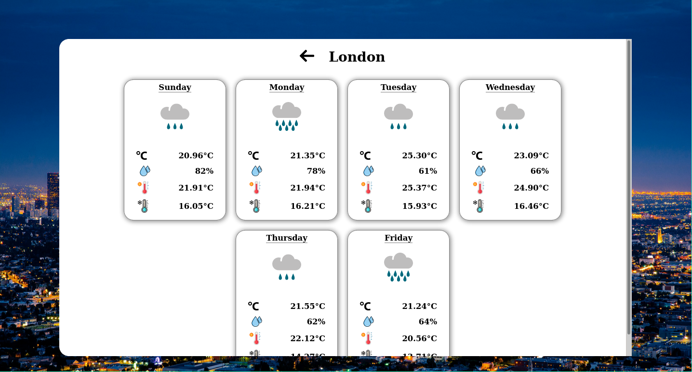

# About this project

A simple weather forecast application built with React, as part of a two-day web development challenge.
The user can search for different locations around the world, and view the weather predictions for the week.

## Installing and running

In the project directory, you can run:

### `npm install`

To install the project dependencies.

### `npm start`

To run the project and view in your browser.
